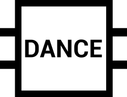

<div style="display:block; margin: 0px auto; width:300px; text-align: center">



</div>

[](https://travis-ci.com/btjanaka/dance)
[](https://codecov.io/gh/btjanaka/dance/branch/master)

Visit the [documentation](https://dance.readthedocs.io/) for complete
information on DANCE.

## Table of Contents

<!-- vim-markdown-toc GFM -->

* [Overview](#overview)
* [Documentation](#documentation)
* [Installation](#installation)
* [Manifest](#manifest)
* [Contributing](#contributing)
* [Contributors](#contributors)
* [Copyright](#copyright)
* [Acknowledgements](#acknowledgements)

<!-- vim-markdown-toc -->

## Overview

Taking a database such as
[eMolecules](https://www.emolecules.com/info/plus/download-database) and
generating a more manageable dataset is a challenging and important step in
improving molecular dynamics force fields. For instance, in order to improve an
angle parameter, one may need a dataset of molecules with that specific
parameter, so that they can generate QM data for training. DANCE is a pipeline
that allows computational chemists to 1) identify relevant molecules and 2)
select a diverse dataset from among those molecules.

## Documentation

The complete documentation for DANCE is available at
https://dance.readthedocs.io/. To build your own version of the documentation,
see [docs/README.md](docs/README.md).

## Installation

DANCE relies on the
[OpenEye Toolkit](https://docs.eyesopen.com/toolkits/python/index.html). The
OpenEye Toolkit is proprietary software, and you will need an OpenEye license to
use DANCE.

Clone the DANCE repository with:

```
git clone https://github.com/btjanaka/dance
```

Then run:

```
pip install --extra-index-url https://pypi.anaconda.org/openeye/simple -e .
```

## Manifest

- **dance** - source code
- **devtools** - tools for people developing DANCE
- **docs** - documentation (built with Sphinx)

## Contributing

Interested in contributing to DANCE? See
[CONTRIBUTING.md](.github/CONTRIBUTING.md)

## Contributors

- [Bryon Tjanaka (UCI)](https://btjanaka.net/)
- [Jessica Maat (UCI)](https://github.com/jmaat)
- [David L. Mobley (UCI)](https://github.com/davidlmobley)

## Copyright

Copyright (c) 2020, Bryon Tjanaka

## Acknowledgements

Project structure based on the
[Computational Molecular Science Python Cookiecutter](https://github.com/molssi/cookiecutter-cms)
version 1.1.
