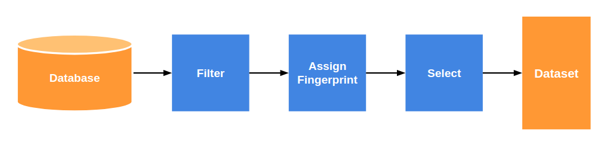

Getting Started
===============

.. toctree::

Taking a database such as
`eMolecules <https://www.emolecules.com/info/plus/download-database>`_ and
generating a more manageable dataset is a challenging and important step in
improving molecular dynamics force fields. For instance, in order to improve an
angle parameter, one may need a dataset of molecules with that specific
parameter, so that they can generate QM data for training. DANCE is a pipeline
that allows computational chemists to 1) identify relevant molecules and 2)
select a diverse dataset from among those molecules.

Design
------

DANCE is a pipeline that takes in a database of molecules and ultimately outputs
a custom dataset. DANCE is designed with the following goals:

- **Extensibility**: One should be able to use DANCE to create a wide variety of
  datasets.
- **Simplicity**: DANCE should require as few parameters as possible to create a
  dataset. Users should be able to focus on the chemical properties of their
  molecules, rather than nitty-gritty pipeline implementation details.

With that in mind, the following diagram shows the layout of DANCE.



The pipeline consists of the following steps:

1. **Filter**: DANCE selects relevant molecules from the database. The user
   controls the filtering by providing a **relevance function**. This is a
   function that, when passed a single molecule, decides whether that molecule
   is relevant to the dataset being generated. For instance, one could pass a
   function that returns *True* only when the molecule has an *a13* parameter.

   1. We (will) provide tools that enable users to easily create relevance
      functions. To illustrate, one such tool allows one to make a function
      that only marks molecules with a certain parameter as relevant.

2. **Assign Fingerprint**: DANCE assigns a "fingerprint" to each molecule. A
   **fingerprint** contains certain features of the molecule, such as the Wiberg
   Bond Order of selected bonds or aromaticity of certain atoms. The user
   controls the fingerprinting by providing a **fingerprint function**, which
   when given a single molecule, returns a fingerprint for it.

   1. Default fingerprinting options are (will be) provided.
   2. Fingerprints need to be tuples/lists of numeric values. This allows us to
      easily order the molecules later on in the pipeline.

3. **Select**: DANCE selects molecules with diverse fingerprints to create the
   final dataset.

   1. Specifically, this step sorts the molecules by their fingerprint and
      selects them at regular intervals (i.e. it selects every *i*-th molecule
      for some constant *i*).

Thus, DANCE is intended to be easy to use. The two main parameters users need to
provide are the **relevance function** (in the Filter step) and the
**fingerprint function** (in the Assign Fingerprint) step.

Installation
------------

.. note::
  DANCE relies on the
  `OpenEye Toolkit <https://docs.eyesopen.com/toolkits/python/index.html>`_.
  The OpenEye Toolkit is proprietary software, and you will need an OpenEye
  license to use DANCE.

Clone the DANCE repository with:

::

  git clone https://github.com/btjanaka/dance

Then run:

::

  pip install --extra-index-url https://pypi.anaconda.org/openeye/simple -e .

Usage
------

DANCE is accessed mainly via a single method, :func:`~dance.run.run_dance`, that
wraps the core :class:`~dance.DancePipeline` class. :func:`~dance.run.run_dance`
takes in a single configuration dict with the fields defined in
``dance.run.DEFAULT_CONFIG``, which is shown below:

.. literalinclude:: ../dance/run.py
   :language: python
   :start-after: __sphinx_doc_begin__
   :end-before: __sphinx_doc_end__

Example
```````

(For the fully completed version of this script, see
`here <https://github.com/btjanaka/dance/tree/master/examples/getting_started_example.py>`_)

Say we would like to create a diverse dataset of molecules that have an oxygen
in them. For the purposes of this example, we define "diverse" as meaning that
the molecules have different numbers of atoms.  Meanwhile, our database is the
eMolecules database, and it is stored in a SMILES file called
``emolecules.smi``. Finally, we would like to output our dataset as another
SMILES file, ``dataset.smi``.

Based on our database, our starting configuration looks like the following:

::

  config = {
      "database_type": "SMILES",
      "database_info": "emolecules.smi",
  }

Next, we can add a relevance function, so that our pipeline chooses only
molecules that have an oxygen in them. The function ``relevant_if_has_oxygen``
returns True if any of the molecule's atoms is an oxygen.

::

  def relevant_if_has_oxygen(mol):
      return any(atom.GetAtomicNum() == 8 for atom in mol.GetAtoms())

  config = {
      "database_type": "SMILES",
      "database_info": "emolecules.smi",
      "relevance_function": relevant_if_has_oxygen,
  }

Now, in order to make the selected dataset diverse in terms of molecule size, we
add a fingerprint function. The function ``size_fingerprint`` returns this
fingerprint, which is simply a tuple with 1 entry, the molecule size.

::

  def relevant_if_has_oxygen(mol):
      return any(atom.GetAtomicNum() == 8 for atom in mol.GetAtoms())

  def size_fingerprint(mol):
      return (mol.NumAtoms(),)

  config = {
      "database_type": "SMILES",
      "database_info": "emolecules.smi",
      "relevance_function": relevant_if_has_oxygen,
      "fingerprint_function": size_fingerprint,
  }

For selecting the final molecules, we need to add a selection frequency. DANCE
does not currently support defining an exact number of molecules for the final
dataset, but setting the selection frequency essentially allows us to determine
what proportion of the possible molecules we would like. In this case, let us
set it to ``3``.

::

  def relevant_if_has_oxygen(mol):
      return any(atom.GetAtomicNum() == 8 for atom in mol.GetAtoms())

  def size_fingerprint(mol):
      return (mol.NumAtoms(),)

  config = {
      "database_type": "SMILES",
      "database_info": "emolecules.smi",
      "relevance_function": relevant_if_has_oxygen,
      "fingerprint_function": size_fingerprint,
      "selection_frequency": 3,
  }

Finally, we need to specify our output, which is the SMILES file
``dataset.smi``.

::

  def relevant_if_has_oxygen(mol):
      return any(atom.GetAtomicNum() == 8 for atom in mol.GetAtoms())

  def size_fingerprint(mol):
      return (mol.NumAtoms(),)

  config = {
      "database_type": "SMILES",
      "database_info": "emolecules.smi",
      "relevance_function": relevant_if_has_oxygen,
      "fingerprint_function": size_fingerprint,
      "selection_frequency": 3,
      "dataset_type": "SMILES",
      "dataset_info": "dataset.smi",
  }

To run our pipeline, we need to import ``dance.run.run_dance()`` and call it.
Thus, our final code looks like this:

::

  from dance.run import run_dance

  def relevant_if_has_oxygen(mol):
      return any(atom.GetAtomicNum() == 8 for atom in mol.GetAtoms())

  def size_fingerprint(mol):
      return (mol.NumAtoms(),)

  config = {
      "database_type": "SMILES",
      "database_info": "emolecules.smi",
      "relevance_function": relevant_if_has_oxygen,
      "fingerprint_function": size_fingerprint,
      "selection_frequency": 3,
      "dataset_type": "SMILES",
      "dataset_info": "dataset.smi",
  }

  run_dance(config)

For more information on DANCE, view the API Documentation.
